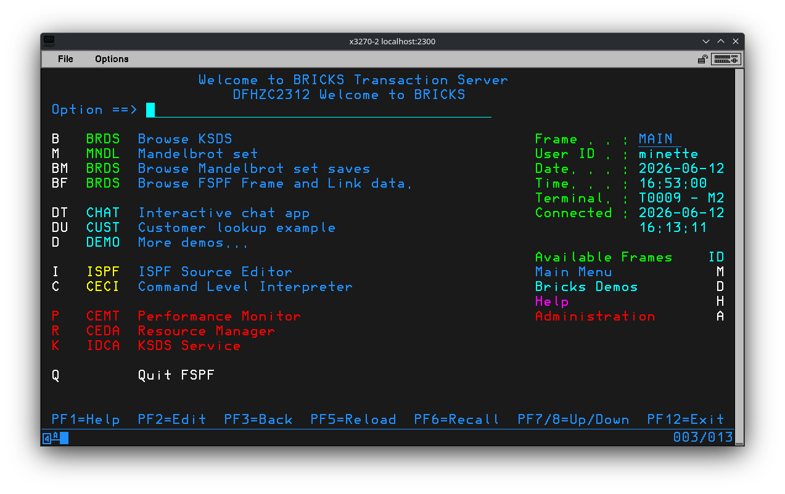
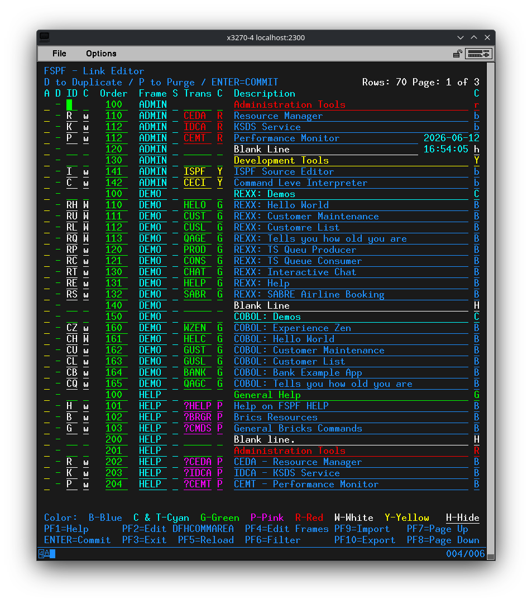
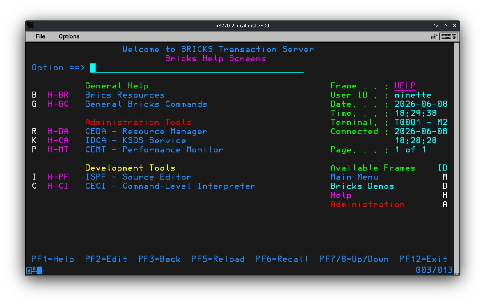
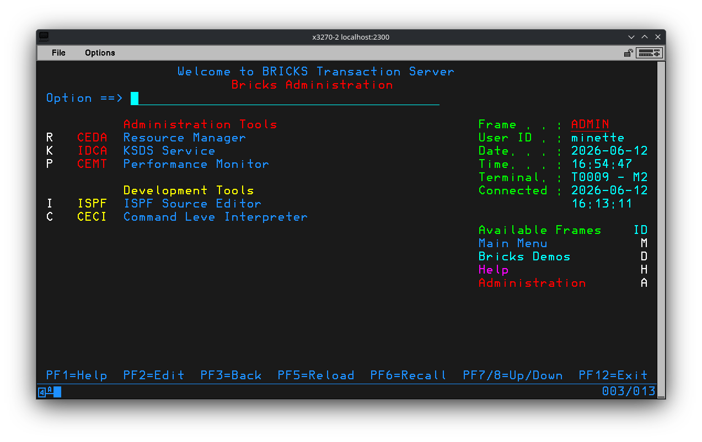
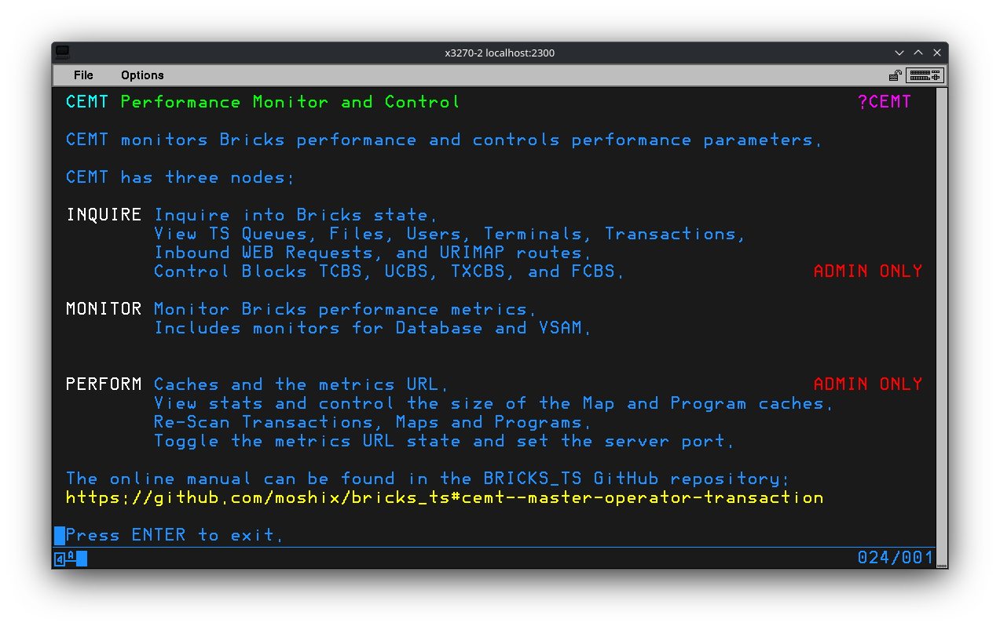
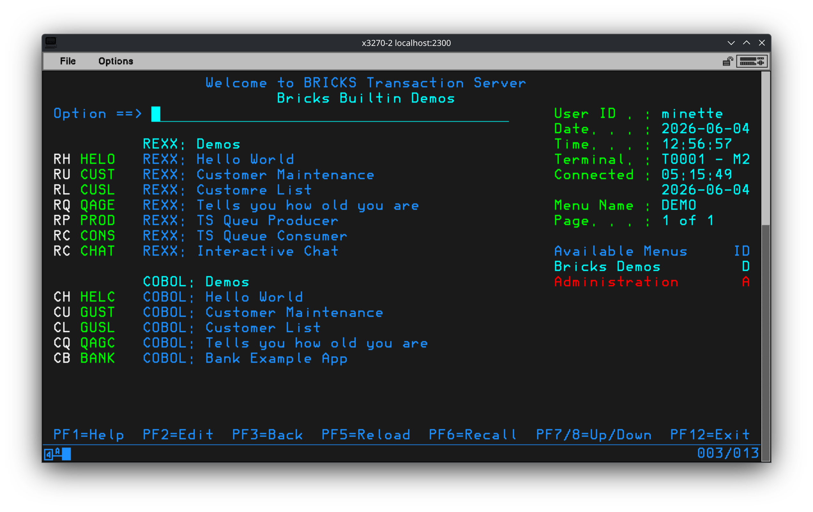

# FSPF - Fake ISPF Menu

**!!WARNING!!** This is very much a Beta project. It works, I make use of it, but there are still bugs. Like the glitch that occasionally makes the clock update run forever. If you encounter any issues please let me know. Either a ticket here on [GitHub](https://github.com/Minette-Codes/Bricks) or in an email to `MinetteCodes AT outlook DOT com`. Thank you. <3

FSPF is a simple menu program. The name is just a silly joke.

FSPF presents Frames, which are composed of Links. Links can link to Transactions, other Frames, or Help Screens.

Links to Transactions may optionally have a value to put in `DFHCOMMAREA` when LINKing to the Transaction. For an example start the FSPF Editor `ESPF`, locate the Link `Browse Mandelbrot set saves`, put the cursor on this Link then press `PF2`. A small popup will prompt for the value to pass via `DFHCOMMAREA`. See `PF1` for help in `ESPF`.

Links can link to a different Frame. This is done by placing a `Y` in the `S` Sub Frame column when editing a Link. For an example start the FSPF Editor `ESPF`, locate the Link `More demos...`, note the `Y` in the `S` column. See `PF1` for help in `ESPF`.

Help screens are separate maps in the `FSPF1` Map Set. Entering `?TOPIC` on the `Option` line will lookup the help screen for that topic. For example enter `?CEDA` for a help screen about the Transaction `CEDA`. There are also Quick Reference screens, like `?QIO` for the quick reference card on Bricks Terminal I/O.

The file `runtime/tmp/fspf_import.txt` contains the default Frames. This file may be imported using the FSPF Editor `ESPF`. Start `ESPF`, Press `PF9` to open an import popup, press `ENTER` to load the default file. You can make your own Frames from scratch, the default examples will make it easier. Importing will **OVERWRITE** existing data. Use caution if you have made customizations.

Likewise the Frame data in Bricks may be exported using the FSPF Editor `ESPF`. Start `ESPF`, Press `PF10` to open an export popup, press `ENTER` to export to the default file `fspf_export.txt`. Use Export to make backups when customizing your Frames. If the export file already exists it will be **DELETED**.

Adding more help screens is as "simple" as adding a new map named `BRICKSHELP####`, where `####` is the topic. See existing examples. "Simple" is in quotes because the new map must be added to all four Map Set files, `runtime/map/fspf1.map`, `runtime/map/fspf1m.map`, `runtime/map/fspf1l.map` and `runtime/map/fspf1w.map`. Note that currently the `BRICKSHELP####` have not been customized for the different terminal styles.

## Option Line Input

FSPF evaluates user input in the following sequence:

* `/TID` to LINK to the given Transaction ID.\
  Example: `/HELP` to run the Transaction `HELP`.
* `@FRAME` to jump directly to a Frame.\
  Example: `@DEMO` to jump to the `DEMO` Frame.
* `?TOPIC` to jump the Help page for `TOPIC` . Works on all Frames.\
  Example: `?ISPF` to show the help screen for `ISPF`.
* `Link ID` to execute the link.\
  Example: `DU` to run the Transaction `HELP`
* `Frame ID` to jump to the Frame.\
  Example: `A` to jump to the `ADMIN` Frame.
* `Frame ID.Link ID` to use a Link in a different Frame.\
  Example: `D.RH` to run the Transaction `HELO`.\
  This says execute the Link with ID `RH` on the Frame with ID `D`.
* A Frame name, Including `MAIN`, to jump to the Frame.\
  Example: `DEMO` to jump to the `DEMO` Frame.
* `Q` to quit.  Works on all Frames.\
  Example: `Q`
* Anything else is treated as a Transaction ID.
  Example: `WZEN` to run the Transaction `WZEN`.

## AID Keys

* **PF1** - Display help text.
* **PF3** - Go back to the `MAIN` Frame or exit if already there.
* **PF5** - Reload the Frame and Link data from the KSDS file.
* **PF6** - Recall the last text input on the `Option` line.
* **PF7** - Scroll the list of Links up. Scroll increment is approximately one third.
* **PF8** - Scroll the list of Links down. Scroll increment is approximately one third.
* **PF12** - Exit `FSPF`.

## Files

```bash
runtime/rexx/fspf.rexx
runtime/rexx/espf.rexx
runtime/tmp/fspf_import.txt
runtime/tmp/fspf_test_links.txt
runtime/tmp/fspf_test_frames.txt
runtime/map/fspf1w.map
runtime/map/fspf1l.map
runtime/map/fspf1.map
runtime/map/fspf1m.map
```

## Transactions

```text
ESPF:rexx:espf.rexx:ADMIN
FSPF:rexx:fspf.rexx:USERS
```

## Screenshots

**NOTE:** There is a Map Set file for the Model 5 terminal, 132x27, but none of the maps have been adjusted for this terminal yet.

FSPF main screen.



Editing the FSPF Frame data. And demonstrating support for Model 4 terminals.



The `HELP` Frame. And demonstrating support for Model 3 terminals.



The `ADMIN` Frame.



Help screen for `CEMT`.



The `DEMO` Frame.



## Changes

* 2026-06-12 - Initial release.
* 2026-06-13 - Remove an old message from the debug information.
* 2026-06-15 - Formatting and spelling fixes.
* 2026-06-15 - Condensed the various popups into a single map. Added the help screen `?LOGO` for help with logging on and off of Bricks.
* 2026-06-18 - Added MRO to the help text for CEDA and CEMT. General improvements to help screens.
* 2026-06-19 - Add the command `QUIT` to the debug console.
* 2026-06-20 - Add a missing `END` for the new debug console `QUIT` command.
* 2026-07-04 - Fix formatting on the Quick Reference screen for AID Keys.
