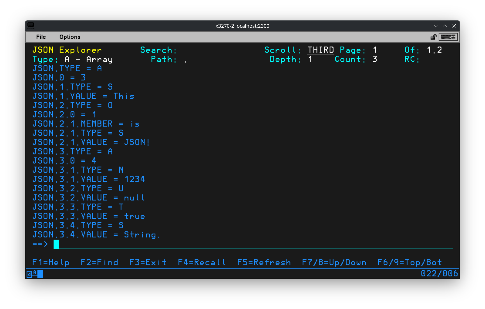
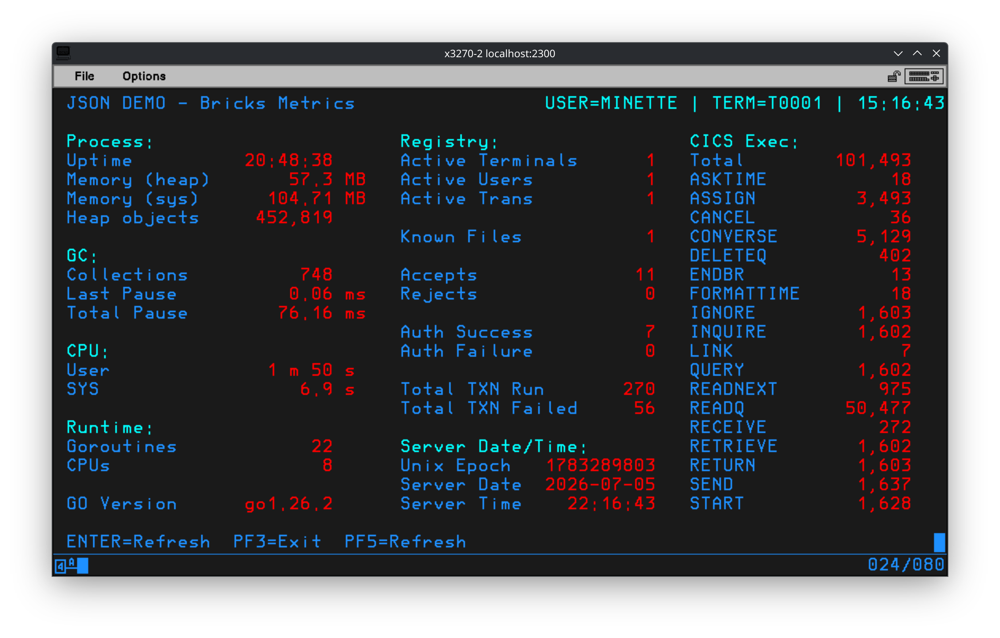
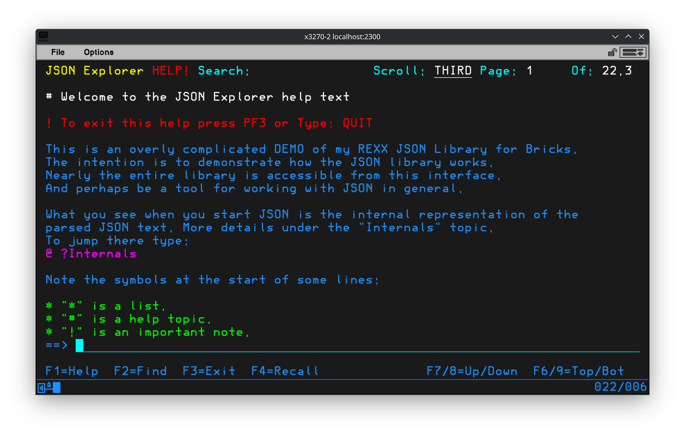
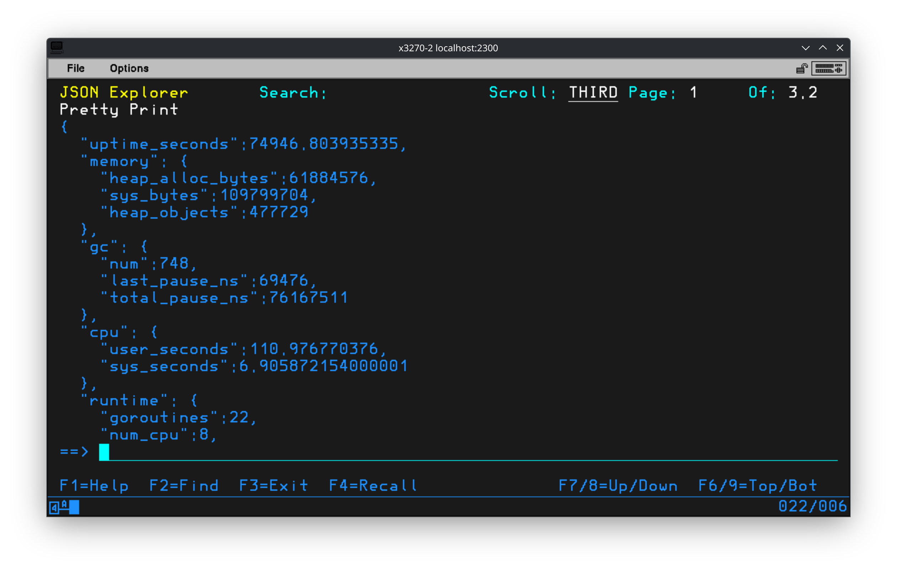
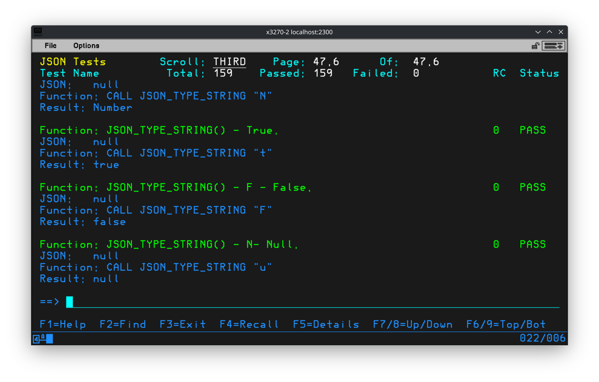
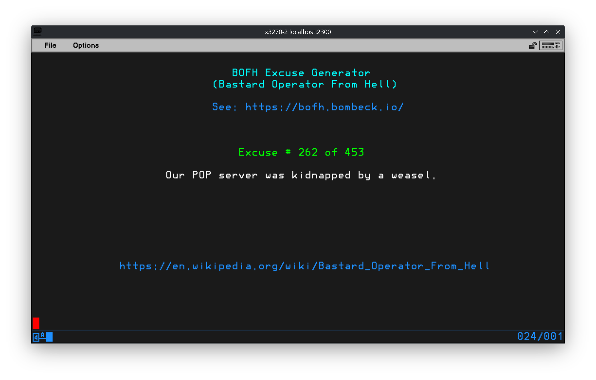

# JSON - A REXX JSON Library for Bricks

This is a REXX library for working with JSON in [Bricks](https://github.com/moshix/bricks_ts).
It uses a pseudo‑conversational interface that grants access to the entire JSON public interface.

**WARNING:** This parser is a hack!
It does not fully adhere to the standard and will fail if input is even SLIGHTLY wrong.
This was written by a parsing amateur.
There is also no effort to consider UTF8 support.
It was created to handle some simple JSON, not serve production workloads.
Or even be useful...

Based on the JSON grammar found at <https://www.json.org/>.
With the addition of both types of comments.

See the file [json-library.rexx](json-library.rexx) for including the library in your code.

## Contents

* [Using the JSON Explorer](#using-the-json-explorer)
* [TODO](#todo)
* [Parsing JSON](#parsing-json)
* [Working with parsed JSON](#working-with-parsed-json)
* [Return values](#return-values)
* [Types](#types)
* [JSON Parser internals](#json-parser-internals)
* [Screenshots](#screenshots)
* [BOFH - JSON Example](#bofh---json-example)
* [Changes](#changes)

<!-- With the help of: https://bitdowntoc.derlin.ch/ -->

## Using the JSON Explorer

The Transaction `JSON` is designed to let you experiment with the JSON library.
The interface works by displaying the internal representation of the parsed JSON.
Commands, and up to two optional arguments, are used to explore and manipulate the JSON data.

Extensive online help is available by typing `HELP` or pressing `PF1`.
There are several topics available.
See the overview at the top of the help text.

Additionally a DEMO is available that displays the Bricks metrics.
The metrics display is modeled after `CEMT M`
The metrics endpoint must be enabled in the [Bricks Configuration File](https://github.com/moshix/bricks_ts#configuration--brickscnf).
Metrics are fetched from the URL <http://localhost:9000/metrics>.
Adjust this URL in the function `_CONS_DEMO_LOAD()` if a different port is configured.
Enter `DEMO` to run the demo.

See screenshots at the bottom of this file.

JSON can also be passed into the Transaction either from the command line or via the COMMAREA.

## TODO

Still to be completed.

* More refinement of the help text.
* Document the test details.
* Expand the tests for more edge cases.
* Properly parse and handle numbers.
  * Parsing numbers just grabs anything that isn't whitespace.
  * Numbers internally are treated like strings. No special considerations.

## Parsing JSON

Parsing JSON is as simple as:

```rexx
RC = JSON_PARSE(JSON_TEXT)
```

On success returns the position in the string where parsing ended.
As this implies any extra JSON in the input is ignored.
With the input `[true][false]` only `[true]` is parsed. Nothing more.
See the table 'Parsing errors codes' for possible error return codes.

## Working with parsed JSON

Working with the parsed JSON is a little more tricky.
This implementation of REXX does not support arrays and hashes as you might
know them. Instead the data is stored in old fashioned REXX arrays.
Objects are stored as an array with the member name next to the value.
See 'JSON Parser internals' for details on how this works.

**TODO:** Explain this better.\
This implementation uses a pointer to keep track of the current element being
worked with. This pointer initially starts at the root of the parsed JSON.
These functions work with the pointer. both moving it and working with the
element pointed to.

### JSON Main Interface

This ins the main interface for exploring and examining the parsed JSON.
See the notes on `Paths` below.

| Function            | Description                                                     |
|---------------------|-----------------------------------------------------------------|
| JSON_CLEAR()        | Clears the JSON STEM.                                           |
| JSON_COUNT()        | The number of elements in the current array or object.          |
| JSON_COUNT(MEMBER)  | The number of elements in for the given member name.            |
| JSON_COUNT(PATH)    | The number of elements in an array or object at the given path. |
| JSON_DEPTH()        | Returns the depth the pointer is at. 1 is the root.             |
| JSON_DEPTH(MEMBER)  | Returns the depth for the member with the given name.           |
| JSON_DEPTH(PATH)    | Returns the depth at the given path.                            |
| JSON_ERROR_TEXT()   | Returns most recent error text.                                 |
| JSON_ERROR_CODE()   | Returns the most recent error code.                             |
| JSON_GET(URL)       | Do an HTTP GET on the given URL and parse the resulting JSON.   |
| JSON_LIST()         | Returns a list of members for the current object.               |
| JSON_LIST(MEMBER)   | Returns a list of members for the given member name.            |
| JSON_LIST(PATH)     | Returns a list of members for the given path.                   |
| JSON_LIST(SEP)      | Returns the list with the given separator instead of a space.   |
| JSON_LIST(MEMBR,SEP)| Returns the list for the given member using the separator.      |
| JSON_LIST(PATH,SEP) | Returns the list for the given path using the separator.        |
| JSON_MEMBER(MEMBER) | Move the pointer to the given member name.                      |
| JSON_NAME()         | Return the name of the current member.                          |
| JSON_NAME(MEMBER)   | Return the name for the given member name.                      |
| JSON_NAME(PATH)     | Return the member name at the given path.                       |
| JSON_NEXT()         | Move to the next element in an array or object.                 |
|                     | Returns the new element index.                                  |
|                     | Returns 0 if the pointer was already at the last element.       |
| JSON_NEXT(PATH)     | Moves the pointer to the next element at the given path.        |
| JSON_PATH()         | Returns the path to the current element.                        |
| JSON_PATH(MEMBER)   | Move the pointer to the given member name.                      |
| JSON_PATH(PATH)     | Move the pointer to the given path.                             |
| JSON_PARENT()       | Moves the pointer to the parent of the current element.         |
|                     | Returns the new depth.                                          |
| JSON_PARSE_END()    | The position in the string parsing stopped.                     |
| JSON_PRETTY()       | Pretty Print the JSON. The default indent is one character.     |
| JSON_PRETTY(IDNENT) | Pretty Print the JSON. Indent the given number of spaces.       |
| JSON_PREV()         | Move to the previous element in an array or object.             |
|                     | Returns the new element index.                                  |
|                     | Returns 0 if the pointer was already at the first element.      |
| JSON_PREV(PATH)     | Moves the pointer to the previous element at the given path.    |
| JSON_ROOT()         | Move the pointer to the JSON root.                              |
| JSON_STRING()       | Returns the JSON converted back to a string.                    |
| JSON_TYPE()         | Returns the Type for the current element.                       |
|                     | See 'Types' below for details.                                  |
|                     | Returns '' on error. For errors check JSON_ERROR_CODE()!        |
| JSON_TYPE(MEMBER)   | Returns the Type for the given member name.                     |
| JSON_TYPE(PATH)     | Returns the Type for the given path.                            |
| JSON_VALUE()        | Return the value of the current element.                        |
|                     | Does not work with arrays or objects.                           |
|                     | Returns '' on error. For errors check JSON_ERROR_CODE()!        |
| JSON_VALUE(MEMBER)  | Return the value for the given member name.                     |
| JSON_VALUE(PATH)    | Return the value at the given path.                             |

### A note on paths

Paths start with a period "." or plus "+" and contain indexes or member names separated by periods.
Paths starting with a period "." are absolute and start from the root.
Paths starting with a plus "+" are relative and start at the current element.

If a member name contains a period "." or is only a number then quote it.
For example `JSON_VALUE('.1."member.name"')`.
Anywhere a path is accepted you may also give a bare array index or member name.
Quoting on member bare member names is only required if the name starts with a period.
For example `JSON_VALUE(1)` and `JSON_VALUE('member.name')`.

A path is really just the tail off the JSON STEM of the array indexes.
See 'JSON Parser internals' for details.

Examples paths for the JSON:

```json
["This", {"is": "JSON!"}, [1234, null, true, "String."]]
```

* `.1` is the string `This`.
* `.2.is` and ".2.1" are both the member `is` in the nested object.
* `.2.'is'` is the same path with the member name quoted.
* `.3.2` is the null in the nested array.
* `+1` is the number `1234` in the nested array when the pointer is `.3`.

### A note on URLs

In addition to the standard URL scheme of `http://HOSTNAME/PATH` the function `JSON_GET()` also
supports the alternate schemes of `map://URIMAP/PATH` or even just `map:URIMAP/PATH`.
Using this alternate scheme `JSON_GET()` using a URIMAP defined in the
[web_routes.conf](https://github.com/moshix/bricks_ts#urimap--named-outbound-endpoints)
configuration file.

For example:

* Add this line to the configuration file `runtime/web_routes.conf`: \
  `URIMAP   METRICS   http://localhost:9000`
* Use one of the following commands: \
  `CALL JSON_GET 'map://METRICS/metrics'` \
  `CALL JSON_GET 'map:METRICS/metrics'`
* Or type this from the JSON Explorer Console: \
  `GET map:METRICS/metrics`

### Special cases for checking types

These are intended to make your code a bit cleaner.
Returns a REXX boolean, 1 for true, 0 for false.

Using these functions you can go from visually noisy:

```rexx
IF JSON_TYPE('.1.1') = 'A' THEN
```

To a bit more clear:

```rexx
IF JSON_IS_ARRAY('.1.1') THEN
```

| Function             | Description                                              |
|----------------------|----------------------------------------------------------|
| JSON_IS_ARRAY()      | Returns 1 if the current element is an Array.            |
| JSON_IS_ARRAY(PATH)  | Returns 1 if the element at the given path is an Array.  |
| JSON_IS_OBJECT()     | Returns 1 if the current element is an Object.           |
| JSON_IS_OBJECT(PATH) | Returns 1 if the element at the given path is an Object. |
| JSON_IS_NUMBER()     | Returns 1 if the current element is a Number.            |
| JSON_IS_NUMBER(PATH) | Returns 1 if the element at the given path is a Number.  |
| JSON_IS_STRING()     | Returns 1 if the current element is a String.            |
| JSON_IS_STRING(PATH) | Returns 1 if the element at the given path is a String.  |
| JSON_IS_TRUE()       | Returns 1 if the current element is true.                |
| JSON_IS_TRUE(PATH)   | Returns 1 if the element at the given path is true.      |
| JSON_IS_FALSE()      | Returns 1 if the current element is false.               |
| JSON_IS_FALSE(PATH)  | Returns 1 if the element at the given path is false.     |
| JSON_IS_NULL()       | Returns 1 if the current element is null.                |
| JSON_IS_NULL(PATH)   | Returns 1 if the element at the given path is null.      |

### JSON Permutation Interface

These functions modify the parsed JSON.
They can also be used to build JSON from scratch after calling `JSON_CLEAR()`.

| Function                     | Description                                         |
|------------------------------|-----------------------------------------------------|
| JSON_ADD()                   | Adds a new element to the current array.            |
|                              | Returns the index number of the new element.        |
| JSON_ADD(PATH)               | Adds a new element to the array at the given path.  |
| JSON_NEW(NAME)               | Adds a new member to the current object.            |
|                              | Returns the index number of the new member.         |
| JSON_NEW(PATH,NAME)          | Adds a new member to the object at the given path.  |
| JSON_DELETE()                | Deletes the current node and children.              |
|                              | Renumbers elements for arrays and objects.          |
| JSON_DELETE(PATH)            | Deletes the node and children at the given path.    |
| JSON_SET_TYPE(TYPE)          | Set the type of the current element.                |
|                              | When setting the type to true, false, or null the   |
|                              | value will also be set to the corresponding value.  |
| JSON_SET_TYPE(PATH, TYPE)    | Set the type of the element at the given path.      |
| JSON_SET_VALUE(VALUE)        | Set the value of the current element.               |
| JSON_SET_VALUE(VALUE, PATH)  | Set the value of the element at the given path.     |
| JSON_SET_NUMBER(VALUE)       | Special case, set type to Number and set value.     |
| JSON_SET_NUMBER(PATH, VALUE) | Special case, set type to Number and set value.     |
| JSON_SET_STRING(VALUE)       | Special case, set type to String and set value.     |
| JSON_SET_STRING(PATH, VALUE) | Special case, set type to String and set value.     |

These work at the current pointer or a path to permute the JSON.
Use caution when using these. There is little sanity checking.
The code assumes you know what you are doing.

### JSON Utilities

These functions are extras that could be useful.

I recommend NOT including the `JSON_TESTS()` function in your code.
Unless you actually intend to run the JSON tests in your code.

| Function              | Description                                         |
|-----------------------|-----------------------------------------------------|
| JSON_ESCAPE(STR)      | Escapes special characters in STR. EG. '"'          |
| JSON_TESTS            | Run the JSON tests in the file 'json_results.txt'.  |
| JSON_TYPE_STRING(TYPE)| Convert a single character type to a string name.   |
| JSON_UNESCAPE(STR)    | Processes any escaped characters in STR. Eg. '\"'   |

### Pretty Printing

The function `JSON_PRETTY()` turns the parsed JSON into formatted text.
This text is stored in the array JSON._PP, with JSON._PP.0 holding the element count.
It is up to you to do something with this array.

For example, this could be used to turn the array into a padded string:

```rexx
STR = ''
DO INDX = 1 TO JSON._PP.0
STR = STR || LEFT(JSON._PP.INDX, 80)
END
```

### JSON Tests

The JSON library has a self test facility.
The function `JSON_TESTS()` will load test from the file `runtime/tmp/json_tests.txt`.
Each test is a line of self contained JSON specifying the test parameters.
Each test contains JSON to be parsed, manipulated and verified.
See the top of the test file for details on the test format.

Note: Tests that are prefixed with `ERROR:` are expected failures.
These tests verify functions fail in the expected manner on bad input.

The test results are stored as strings in the STEM `JSON_TESTS`.
Search for uses this STEM to see what to do with the contents.

**TODO:** Add more documentation here.

In the JSON Explorer Console the tests can be run using the command `TEST`.
After the tests are run the results will be displayed with some basic formatting applied.
The test name, error code, and pass/fail status are displayed on one line.
The remaining test data is listed below the test name..
Simple highlighting is applied to make specific bits stand out.
See the screenshots below for an example of the test output.

## Return values

Functions normally returns either a new value or 1 on success.
If there is an error a negative value will be returned.
Use `JSON_ERROR_TEXT()` to get the text for the most recent error.
Use `JSON_ERROR_CODE()` to get the most recent error code.
0 is never used as an error.
0 is only used by next and prev to indicate end of list reached.
Note that `JSON_VALUE()` and `JSON_TYPE()` will return an empty string on error.
Check `JSON_ERROR_CODE()` to see if these two failed.

### General error codes

| Code  | Description                                                       |
|-------|-------------------------------------------------------------------|
|  0    | No further results.                                               |
| -1    | Something failed.                                                 |
|       | You should not see this unless I made a big mistake.              |
| -20   | Missing argument.                                                 |
| -21   | Invalid type for the function.                                    |
| -22   | Already at the root.                                              |
| -23   | Member already exists in the object.                              |
| -24   | Path is invalid or does not exist.                                |
| -25   | Index out of range or does not exist.                             |
| -26   | Member does not exist.                                            |

### JSON_GET(URL) error codes

| Code  | Description                                                       |
|-------|-------------------------------------------------------------------|
| -30   | Error parsing the given URL.                                      |
| -31   | Error opening a connection to the host in the URL.                |
| -32   | Error sending the HTTP request to the given URL.                  |

### Parsing specific errors codes

| Code  | Function            | Description                                 |
|-------|---------------------|---------------------------------------------|
| -10   | JSON_PARSE          | Unexpected end of JSON.                     |
| -11   | _JSON_PARSE_ELEMENT | Unknown element type.                       |
| -12   | _JSON_PARSE_ARRAY   | Expected closing array brace "]".           |
| -13   | _JSON_PARSE_OBJECT  | Expected a quoted member name.              |
| -14   | _JSON_PARSE_OBJECT  | Expected a colon, ":", after member name.   |
| -15   | _JSON_PARSE_OBJECT  | Expected closing object brace "}".          |
| -16   | _JSON_PARSE_STRING  | Unexpected end of string.                   |

### Integrated test specific errors codes

| Code  | Function            | Description                                 |
|-------|---------------------|---------------------------------------------|
| -90   | JSON_TESTS          | Unable to read the tests file.              |
| -91   | JSON_TESTS          | Required test variable missing.             |
| -92   | JSON_TESTS          | Invalid path given in test.                 |

## Types

Types are stored as a single letter code.

| Code | Meaning  | JSON                  |
|------|----------|-----------------------|
| A    | Array    | ["Array"]             |
| F    | False    | false                 |
| N    | Number   | 123.456               |
| O    | Object   | {"Member": "Element"} |
| S    | String   | "String"              |
| T    | True     | true                  |
| U    | NULL     | null                  |

## JSON Parser internals

This information is if you want to bypass the public interface and work
directly with the parsed JSON data.

The parsed data is stored in the STEM `JSON` starting at the top level.
The type for each element is stored in the TAIL `.TYPE`.
See "Types" above.
The value for scalar values are stored in the TAIL `.VALUE`.
Arrays and objects are stored as standard 1 based REXX arrays.
The number of elements in an array or object is stored in the TAIL `.0`.
Each element is stored in a TAIL with an incrementing number. Eg. `.1`, `.2` ...
Objects store the member name in the tail `.MEMBER`.

To scan an array simply loop over the TAILs of the array STEM.
To find a member in an object check each of the 'MEMBER' tails for the name.
See the functions JSON_NEXT(), JSON_PREV() and JSON_PATH(NAME) for examples.

Some of this is redundant.
I am attempting to give enough ways to see how this works internally to try and make sense.

### Example Parsed JSON

This is an example of how JSON is represented internally.
This test JSON is what loads by default when the JSON Explorer starts.

```json
["This", {"is": "JSON!"}, [1234, null, true, "String."]]
```

| STEM                      | Meaning                                     |
|---------------------------|---------------------------------------------|
| JSON.TYPE = A             | The root level element is an array.         |
| JSON.0 = 3                | The root level array has 3 elements.        |
| JSON.1.TYPE = S           | This element is a string.                   |
| JSON.1.VALUE = This       | The first element in the root level array.  |
| JSON.2.TYPE = O           | This element is an object.                  |
| JSON.2.0 = 1              | The number of elements in the object.       |
| JSON.2.1.MEMBER = is      | The name of the first member.               |
| JSON.2.1.TYPE = S         | The type of the first member.               |
| JSON.2.1.VALUE = JSON     | The value for first member is "is".         |
| JSON.3.TYPE = A           | This element is an array.                   |
| JSON.3.0 = 4              | The second array has 4 elements.            |
| JSON.3.1.TYPE = N         | This element is a number.                   |
| JSON.3.1.VALUE = 1234     | First element of the second array.          |
| JSON.3.2.TYPE = U         | This element is null.                       |
| JSON.3.2.VALUE = null     | The second element in the second array.     |
| JSON.3.3.TYPE = T         | This element is a number,                   |
| JSON.3.3.VALUE = true     | The third element of the second array.      |
| JSON.3.4.TYPE = S         | This element is a string.                   |
| JSON.3.4.VALUE = String.  | The fourth element in the second array.     |
| JSON._JSON = ["This",     | The original JSON text that was parsed.     |
| JSON._LEN = 61            | Length of the text.                         |
| JSON._END = 63            | Where parsing ended in the original text.   |

### A different take on the Example

The same example, rearranged to show how the parsed JSON matches the text.

```json
["This", {"is": "JSON!"}, [1234, null, true, "String."]]
```

| STEM                     | JSON          | Meaning                 |
|--------------------------|---------------|-------------------------|
| JSON.TYPE = A            | [             | This is an array.       |
| JSON.0 = 3               |               | 3 items in this array.  |
| JSON.1.TYPE = S          |               | This is a string.       |
| JSON.1.VALUE = This      |   "This",     | The string "This".      |
| JSON.2.TYPE = O          |   {           | This is an object       |
| JSON.2.0 = 1             |               | One item in the object. |
| JSON.2.1.MEMBER = is     |     "is":     | The Member "is".        |
| JSON.2.1.TYPE = S        |               | This is a string        |
| JSON.2.1.VALUE = JSON    |     "JSON!"   | The string "JSON!".     |
|                          |   },          | Illustration only.      |
| JSON.3.TYPE = A          |   [           | This is of an array.    |
| JSON.3.0 = 4             |               | 4 items in this array.  |
| JSON.3.1.TYPE = N        |               | This is a number.       |
| JSON.3.1.VALUE = 1234    |     1234,     | The number 1234         |
| JSON.3.2.TYPE = U        |               | This is null.           |
| JSON.3.2.VALUE = null    |     null,     | null                    |
| JSON.3.3.TYPE = T        |               | This is true.           |
| JSON.3.3.VALUE = true    |     true,     | true                    |
| JSON.3.4.TYPE = S        |               | This is a string.       |
| JSON.3.4.VALUE = String. |     "String." | The string "String."    |
|                          |   ]           | Illustration only.      |
|                          | ]             | Illustration only.      |

### Internal Representation per Type

How each type is represented internally.

| Type    | Tail             | Meaning                           |
|---------|------------------|-----------------------------------|
| Array   | .TYPE = A        | Array type.                       |
|         | .0 = 1           | Number of elements in the array.  |
|         | .1.VALUE         | The value of the first element.   |
| Object  | .TYPE = O        | Object type.                      |
|         | .0 = 1           | Number of elements in the object. |
|         | .1.MEMBER = NAME | The NAME of the first member.     |
| String  | .TYPE = S        | String type.                      |
|         | .VALUE = STRING  | The SRING value of the string.    |
| Number  | .TYPE = N        | Number type.                      |
|         | .VALUE = NUMBER  | The NUMBER value of the number.   |
| true    | .TYPE = T        | True type.                        |
|         | .VALUE = true    | The value true.                   |
| false   | .TYPE = F        | False type.                       |
|         | .VALUE = false   | The value false.                  |
| null    | .TYPE = U        | Null type.                        |
|         | .VALUE = null    | The value null.                   |

### JSON Element Tails

These are the various TAILS used to represent JSON.

| Tail    | Purpose                                            |
|---------|----------------------------------------------------|
| .0      | The number of elements in an Array or Object.      |
| .MEMBER | The name of the member. For Objects.               |
| .TYPE   | The element type.                                  |
| .VALUE  | The element value. Not used for Arrays or Objects. |

### Internal meta data

Meta data about the JSON and internal state.

(Please do not modify these. Strange things will happen.)

| Variable        | Purpose                                     |
|-----------------|---------------------------------------------|
| JSON._END       | The position in the string parsing stopped. |
| JSON._ERROR     | Text from the most recent error.            |
| JSON._ERRORCODE | The most recent error code.                 |
| JSON._LEN       | The length of the original JSON string.     |
| JSON._PP        | Pretty printed JSON array.                  |
| JSON._PTR       | Used to explore the parsed JSON.            |
| JSON._STATUS    | HTTP Status code from JSON_GET(URL).        |
| JSON._JSON      | The original JSON string.                   |
| JSON._URL       | The URL passed to JSON_GET(URL).            |

## Screenshots

The initial view of the JSON Explorer.
The JSON being displayed is the example from the documentation above.



Bricks Metrics demo.



The JSON Explorer Help text.



The result of the `PRETTY` command to pretty print parsed JSON.
Specifically this is the result of the command `PRETTY 2` to indent by two characters.



The bottom of the test results page. Use the command `TEST` to run the tests and display the result.



## BOFH - JSON Example

A simple example of using the [JSON library](JSON.md) to fetch and display an excuse.
See the site <https://bofh.bombeck.io/> for details.



## Changes

* 2026-07-05 - Moved the documentation out of the library and into this file.
