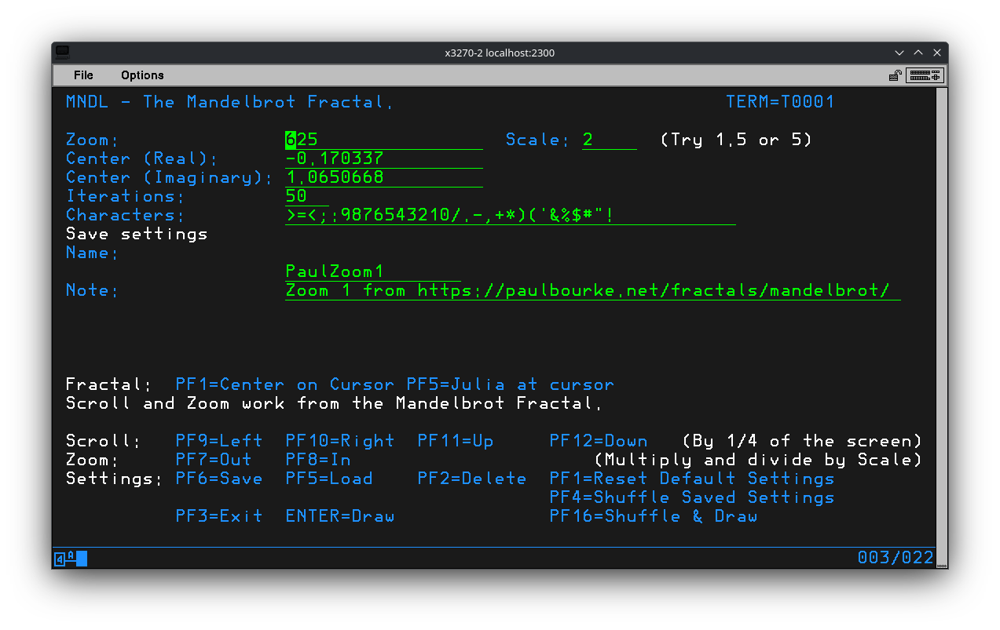
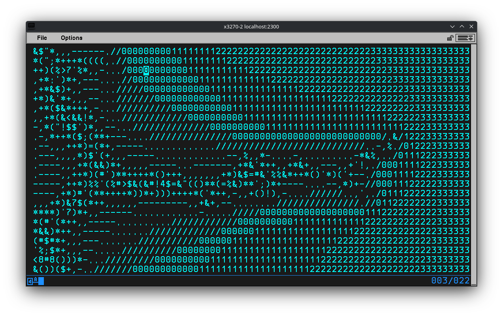
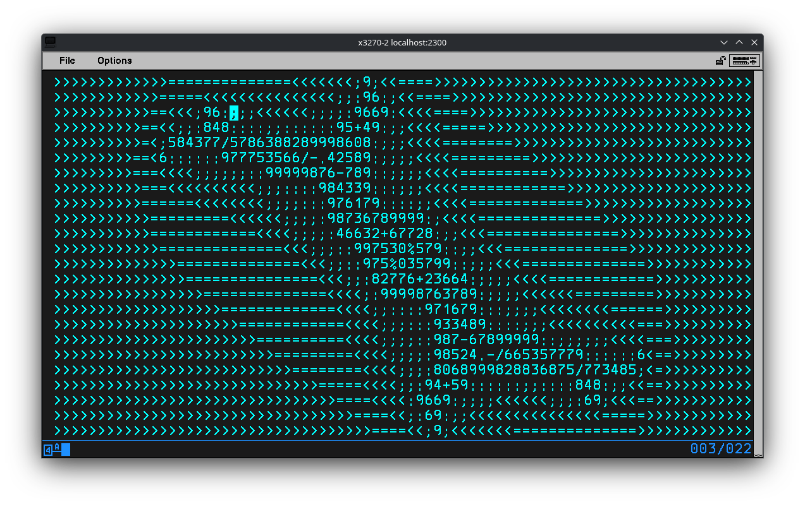
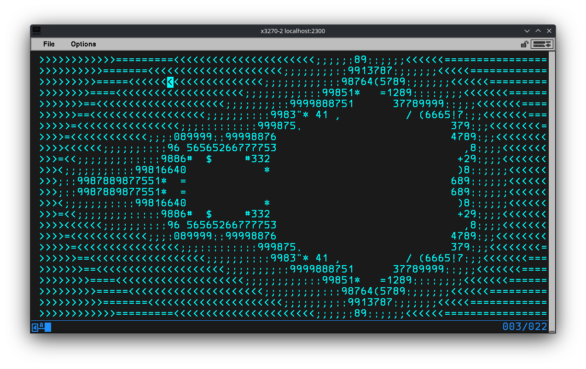
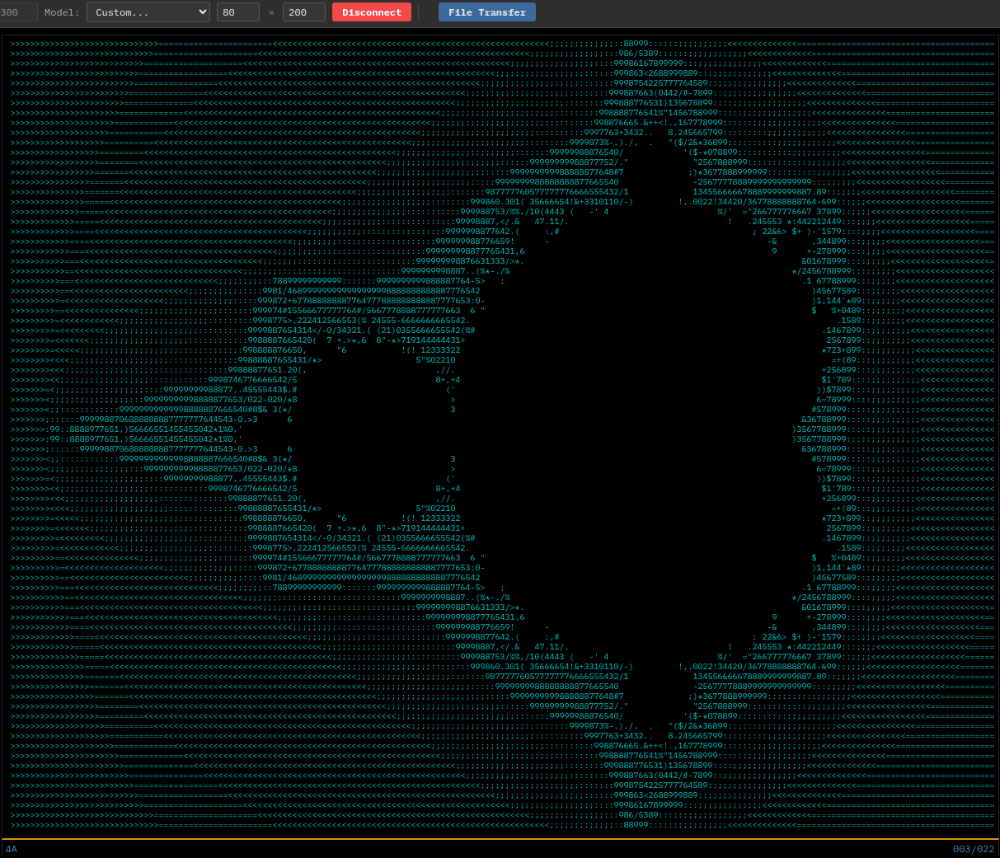
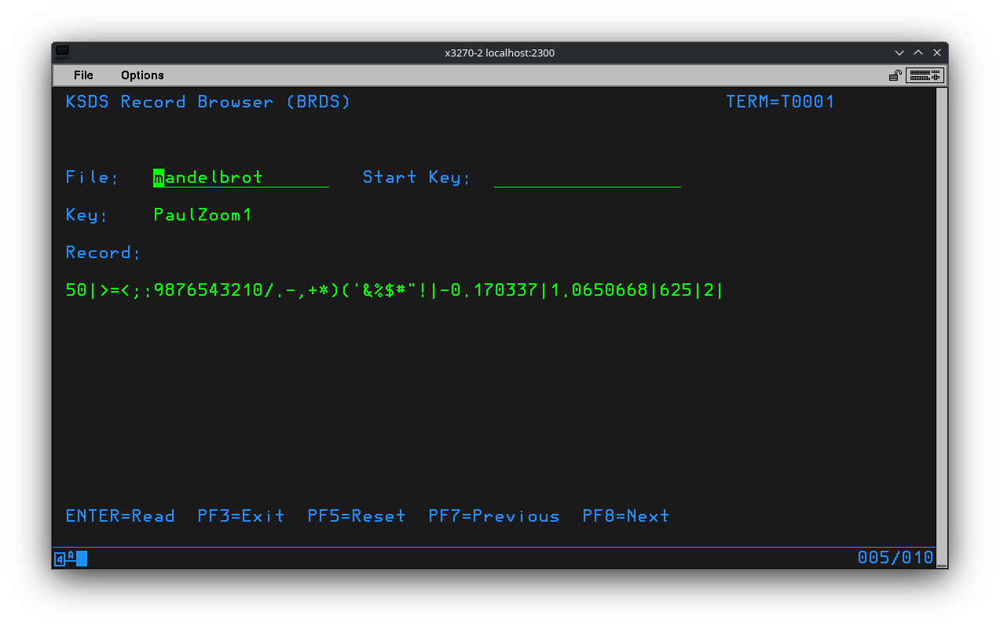

# Minette-Codes: Bricks

Some stuff I wrote for Bricks. \
<https://github.com/moshix/bricks_ts>.

## Installation

* First you need to get [Bricks](https://github.com/moshix/bricks_ts) running. Follow the readme.
* Copy the contents of `runtime/` over top of your Bricks directory. No files should be overwritten.
* Add the desired transactions to your file `runtime/transactions.conf`.

## Mandelbrot

Generates a mandelbrot set.

Use `MNDL` to generate a Mandelbrot fractal in ASCII. You can zoom in/out, scroll the fractal, re-center at the cursor, generate a Julia set with the cursor and save settings. You can also rotate through the saved settings, even while displaying the fractal.

Use the included utility `MNDU` to import, export and delete saves. The included `runtime/tmp/mndl_import.txt` includes some saves. When importing any existing saves are NOT overwritten.

Adapted from: <https://rosettacode.org/wiki/Mandelbrot_set> \
(With help from Google.)

See also:
* <https://www.dynamicmath.xyz/mandelbrot-julia/>
* <https://paulbourke.net/fractals/juliaset/>

### Files

```
runtime/rexx/mndl.rexx
runtime/rexx/mndu.rexx
runtime/map/mndl1.map
runtime/map/mndu1.map
runtime/tmp/mndl_import.txt
```

### Transactions

```
MNDL:rexx:mndl.rexx:USERS
MNDU:rexx:mndu.rexx:USERS
```

### Screenshots

The main menu showing the saved setting **PaulZoom1**.



The Mandelbrot fractal generated from the saved setting **PaulZoom1**.



The Julia set generated from the cursor in the previous screenshot.



The Mandelbrot fractal generated from the details settings.




### Fun thing to try

* Open the web terminal for Bricks <http://localhost:9000/>.
* Adjust the size to something giant like 80x200.
* Set the font as small as it will go.
* Wait.....



## KSDS Browser

A simply utility I wrote to hel when developing `MNDL` and `MNDU`.

`BRDS` prompts for a **KSDS** file then displays each record with a cursor. Nothing fancy, just a way to look at what is in the database. The record is truncated, because I'm lazy.

### Files

```
runtime/rexx/brds.rexx
runtime/map/brds1.map
```

### Transactions

```
BRDS:rexx:brds.rexx:USERS
```

### Screenshots

Browsing the saved settings for `MNDL`.


