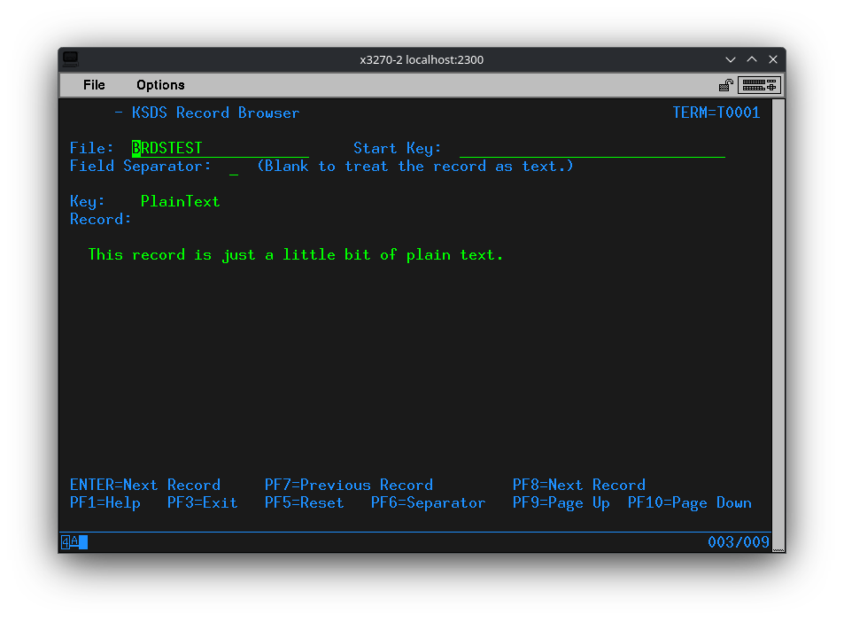
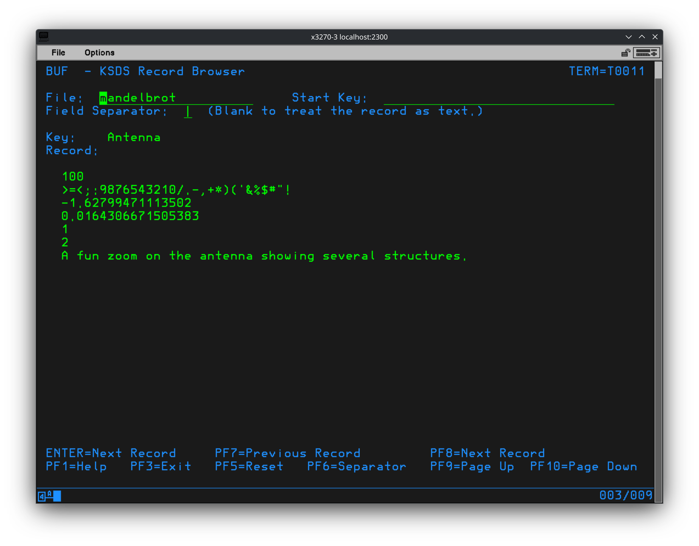
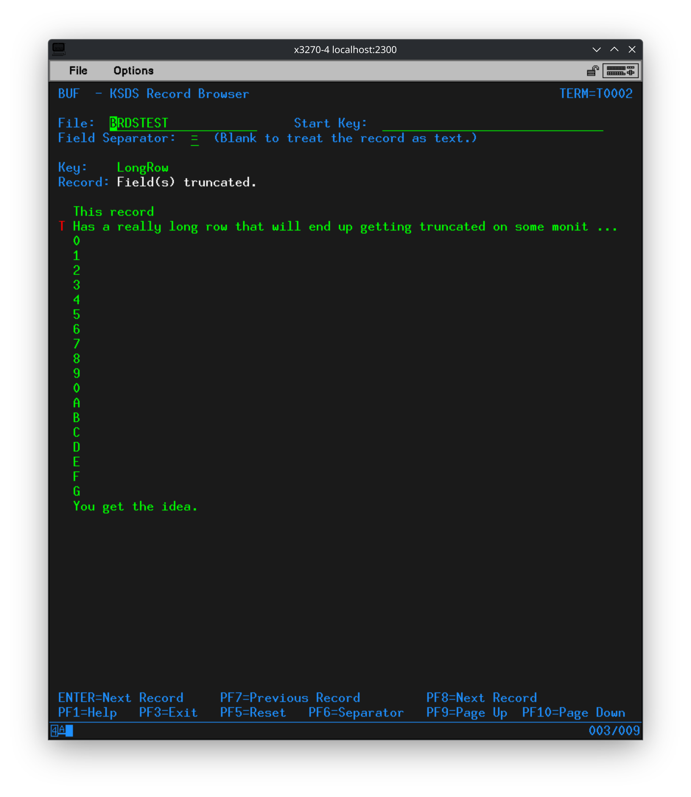
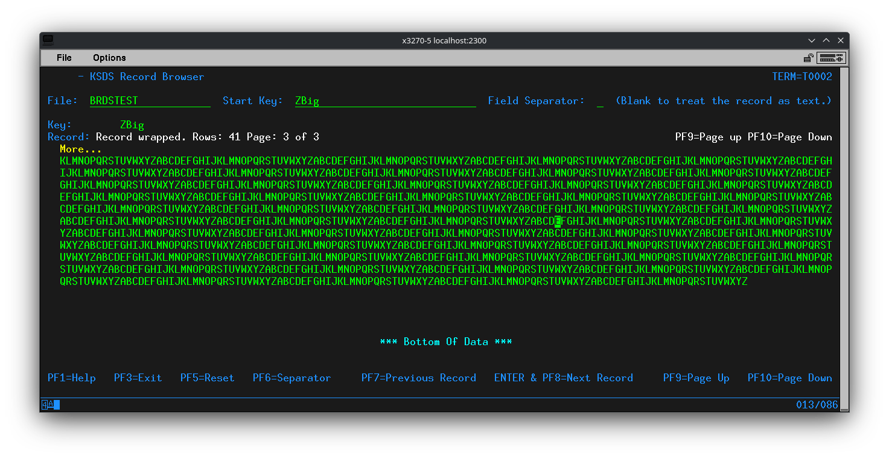

# Minette-Codes: Bricks

Some stuff I wrote for Bricks. \
<https://github.com/moshix/bricks_ts>.

`MNDL` and `BRDS` are now included in the [Bricks](https://github.com/moshix/bricks_ts) repository. No need to futz around, just go install [Bricks](https://github.com/moshix/bricks_ts)!

## Contents

* [MNDL - Mandelbrot Set Viewer](#mndl---mandelbrot-set-viewer)
* [BRDS - KSDS File Browser](#brds---ksds-file-browser)
* [FSPF - Fake ISPF Menu](#fspf---fake-ispf-menu)
* [Go Script](#go-script)
* [Installation](#installation)
* [License](#license)

<!-- With the help of: https://bitdowntoc.derlin.ch/ -->

## MNDL - Mandelbrot Set Viewer

Use `MNDL` to generate a Mandelbrot set fractal in plain text. You can zoom in/out, scroll the window, re-center at the cursor, generate a Julia set at the cursor and save/load settings. You can also rotate through the saved settings, even while displaying the fractal. If a save name is passed on the command line it will be rendered immediately.

Use the included utility `MNDU` to import, export and delete saves. The included `runtime/tmp/mndl_import.txt` includes some saves. When importing any existing saves are NOT overwritten.

Adapted from: <https://rosettacode.org/wiki/Mandelbrot_set> \
(With help from Google.)

See also:

* <https://en.wikipedia.org/wiki/Mandelbrot_set>
* <https://www.dynamicmath.xyz/mandelbrot-julia/>
* <https://paulbourke.net/fractals/juliaset/>

### Files

```bash
runtime/rexx/mndl.rexx
runtime/rexx/mndu.rexx
runtime/map/mndl1.map
runtime/map/mndu1.map
runtime/tmp/mndl_import.txt
```

### Transactions

```text
MNDL:rexx:mndl.rexx:USERS
MNDU:rexx:mndu.rexx:USERS
```

### Screenshots

The main menu showing the saved setting **PaulZoom1**.


The Mandelbrot fractal generated from the saved setting **PaulZoom1**.


The Julia set generated from the cursor in the previous screenshot.


The Mandelbrot fractal generated from the default settings.


Showing the overlay with helpful information, help for the AID keys and a marker in the center. This also shows that the cursor is positioned in the center now.


### Fun thing to try

* Open the web terminal for Bricks <http://localhost:9000/>.
* Adjust the size to something giant like 80x200.
* Set the font as small as it will go.
* Wait.....


### Changes

* 2026-05-25 - Initial release.
* 2026-05-26 - Added an overlay with useful information. Also position the cursor in the center.
* 2026-05-26 - A new save for the Antenna, the long part on the left. Keep zooming.
* 2026-05-27 - Fix the page handling code. It was backwards, and didn't update the current page number.
* 2026-06-01 - Adjusted the maps a bit to be more clear.
* 2026-06-02 - If a save is passed on the command line render it immediately.
* 2026-06-02 - Check DFHCOMMAREA for a save to be loaded.

## BRDS - KSDS File Browser

A utility I wrote to help when developing `MNDL` and `MNDU`. It lets you browse the records in a **KSDS** file.

The record can be parsed into fields using a separator character. In this mode if a field exceeds the display width it will be truncated. If a record is truncated a red **T** is displayed to the left and the right ends in `...` as visual indicators. A note will be displayed indicating field(s) have been truncated, which may be off screen.

If no separator is provided the record is displayed as plain text. In this mode if a field exceeds the display width it will be wrapped. A note will be displayed indicating the record has been wrapped.

If the number of rows exceeds the display height then the list can be scrolled using **PF9** and **PF10**. Markers indicate where there is more data up or down and if at the top or bottom of the list. The current page and the total number of pages are displayed.

When `BRDS` exits it sets **DFHCOMMAREA** to the current file, key and field separator, just like it is specified on the command line. This is intended to allow other programs to **LINK** to `BRDS` to pick a record to be returned. This has the added bonus that **DFHCOMMAREA** persists in your session, so it acts like a place holder. When you start `BRDS` again it will pick up where you left off.

If you are calling BRDS and and expecting record details to be returned in **DFHCOMMAREA** be aware of the formatting. It is just like command line arguments. Which means the first field might be `-s`. If present `-s` will be followed by the separator. For example `-s | MANDELBROT Antenna` means the separator is `|`, the file is `MANDELBROT` and the record key was `Antenna`. The same example without the separator `MANDELBROT Antenna`.

### Fields

* File: The **KSDS** file to browse. REQUIRED.
* Start Key: The key to start from. This is passed to **STARTBR** when opening or resetting the cursor. Optional.
* Field Separator: Parse the record into fields using the separator. You can use any character. Optional.

### AID Keys

* **PF1** - Display help text. The same text when giving the `-h` command line option.
* **PF3** - Exit.
* **PF5** - Reset the cursor with **RESETBR**.
* **PF6** - Rotate the separator through the list `|`, `,`, `;`, `:`, `~`, and blank to display the record as plain text.
* **PF7** - Read the previous record with **READPREV**.
* **PF8** - Read the next record with **READNEXT**. Also **Enter**.
* **PF9** - Scroll the field list up.
* **PF10** - Scroll the field list down.
* **PF13** - Display debug information. Long values will be truncated to fit in the display width. \
  Shows the contents of the STEMS:
  * `SET.` containing settings.
  * `SCR.` containing the screen data for the **MAP**.
  * `FIELDS.` containing the parsed fields or the text of the record split into rows.

  *(This key is not noted anywhere else. It is only intended for development and bug hunting.)*
* **PF23** - A demonstration of using **LINK** to call `BRDS`. **DFHCOMMAREA** contains `-s ~ BRDSTEST ReallyBig Press F3 to return.`. Test data will be created in the file **BRDSTEST** before the call is made.

  *(This key is not noted anywhere else. It is only intended for developers calling `BRDS`)*
* **PF24** - BRDS demo. Creates test data in the file **BRDSTEST** then browses the file.

### Command Line

Using the command line you can provide `BRDS` with the **KSDS** file name, the starting key, the field separator and even display a message to the user.

Command line usage: `BRDS [-h] [-s SEPARATOR] [FILE_NAME [START_KEY] [MESSAGE]]`

To display a message the start key is required. Everything after the the start key is used for the message, displayed as an error.

Examples:

```text
BRDS -s | MANDELBROT
BRDS MANDELBROT Defaults
BRDS BRDSTEST ReallyBig This is a message the user will see in RED.
```

You can **CICS** **LINK** to `BRDS` passing command line options via **DFHCOMMAREA**. for example `COMMAREA = '-s | MANDELBROT Paul'` When BRDS returns it will set **DFHCOMMAREA** to the current file, key and field separator.

### Files

```text
runtime/rexx/brds.rexx
runtime/map/brds1.map
runtime/map/brds1l.map
runtime/map/brds1m.map
runtime/map/brds1w.map

```

### Transactions

```text
BRDS:rexx:brds.rexx:USERS
```

### Screenshots

Viewing a simple plain text record on a Model 2 terminal.



Viewing one of the `MNDL` saves on a Model 3 terminal.



Viewing a record with a long field truncated on a Model 4 terminal. Note the red `T` noting the field has been truncated and the `...` at the end also showing it was truncated.



Viewing a rather large record on the enormous Model 5 terminal.



### Changes

* 2026-05-25 - Initial release.
* 2026-05-27 - Read the file and starting key from the command line. Handle going past the last record more gracefully. The cursor is re-opened and the last record re-read so you can keep scrolling through the data.
* 2026-05-29 - Complete overhaul. Better interface. Show all of a record. Split records into fields by a separator. Test data for demonstration. Help text. And bugs fixed.
* 2026-05-30 - Removed the requirement for the transaction ID to be in COMMAREA.
* 2026-05-30 - Properly handle DFHCOMMAREA. I didn't understand it...
* 2026-05-30 - Made the AID keys for scrolling through the displayed data more prominent.
* 2026-06-01 - Adjusted the maps to add more rows of data.
* 2026-06-06 - Fixed an issue parsing records with empty fields. These would cause parsing to stop.
* 2026-06-06 - Fixed handling of command line arguments and DFHCOMMAREA. Added a record to test data to exercise this fix.
* 2026-06-06 - Correctly include the separator in DFHCOMMAREA when quitting.
* 2026-06-06 - Off by one error where the last field could be dropped.
* 2026-06-15 - Hopefully handling command line arguments correctly.

### The future?

Thoughts on future improvements. Feedback welcome.

* Store record formats for tables to allow fields to be labelled. This should support delimited and fixed width records. With a condition to check if the format applies to a record. Automatically apply a separator at the table and format level. Admin only!

* Delete the current record, with confirmation. Admin only!

* Edit the plain text of a record. Prevent editing if the record contains non-printable characters. Admin only!

## FSPF - Fake ISPF Menu

**!!WARNING!!** This is very much a Beta project. It works, I make use of it, but there are still bugs. Like the glitch that occasionally makes the clock update run forever. If you encounter any issues please let me know. Either a ticket here on [GitHub](https://github.com/Minette-Codes/Bricks) or in an email to `MinetteCodes AT outlook DOT com`. Thank you. <3

FSPF is a simple menu program. The name is just a silly joke.

FSPF presents Frames, which are composed of Links. Links can link to Transactions, other Frames, or Help Screens.

Links to Transactions may optionally have a value to put in `DFHCOMMAREA` when LINKing to the Transaction. For an example start the FSPF Editor `ESPF`, locate the Link `Browse Mandelbrot set saves`, put the cursor on this Link then press `PF2`. A small popup will prompt for the value to pass via `DFHCOMMAREA`. See `PF1` for help in `ESPF`.

Links can link to a different Frame. This is done by placing a `Y` in the `S` Sub Frame column when editing a Link. For an example start the FSPF Editor `ESPF`, locate the Link `More demos...`, note the `Y` in the `S` column. See `PF1` for help in `ESPF`.

Help screens are separate maps in the `FSPF1` Map Set. Entering `?TOPIC` on the `Option` line will lookup the help screen for that topic. For example enter `?CEDA` for a help screen about the Transaction `CEDA`. There are also Quick Reference screens, like `?QIO` for the quick reference card on Bricks Terminal I/O.

The file `runtime/tmp/fspf_import.txt` contains the default Frames. This file may be imported using the FSPF Editor `ESPF`. Start `ESPF`, Press `PF9` to open an import popup, press `ENTER` to load the default file. You can make your own Frames from scratch, the default examples will make it easier. Importing will **OVERWRITE** existing data. Use caution if you have made customizations.

Likewise the Frame data in Bricks may be exported using the FSPF Editor `ESPF`. Start `ESPF`, Press `PF10` to open an export popup, press `ENTER` to export to the default file `fspf_export.txt`. Use Export to make backups when customizing your Frames. If the export file already exists it will be **DELETED**.

Adding more help screens is as "simple" as adding a new map named `BRICKSHELP####`, where `####` is the topic. See existing examples. "Simple" is in quotes because the new map must be added to all four Map Set files, `runtime/map/fspf1.map`, `runtime/map/fspf1m.map`, `runtime/map/fspf1l.map` and `runtime/map/fspf1w.map`. Note that currently the `BRICKSHELP####` have not been customized for the different terminal styles.

### Option Line Input

FSPF evaluates user input in the following sequence:

* `/TID` to LINK to the given Transaction ID.\
  Example: `/HELP` to run the Transaction `HELP`.
* `@FRAME` to jump directly to a Frame.\
  Example: `@DEMO` to jump to the `DEMO` Frame.
* `?TOPIC` to jump the Help page for `TOPIC` . Works on all Frames.\
  Example: `?ISPF` to show the help screen for `ISPF`.
* `Link ID` to execute the link.\
  Example: `DU` to run the Transaction `HELP`
* `Frame ID` to jump to the Frame.\
  Example: `A` to jump to the `ADMIN` Frame.
* `Frame ID.Link ID` to use a Link in a different Frame.\
  Example: `D.RH` to run the Transaction `HELO`.\
  This says execute the Link with ID `RH` on the Frame with ID `D`.
* A Frame name, Including `MAIN`, to jump to the Frame.\
  Example: `DEMO` to jump to the `DEMO` Frame.
* `Q` to quit.  Works on all Frames.\
  Example: `Q`
* Anything else is treated as a Transaction ID.
  Example: `WZEN` to run the Transaction `WZEN`.

### AID Keys

* **PF1** - Display help text.
* **PF3** - Go back to the `MAIN` Frame or exit if already there.
* **PF5** - Reload the Frame and Link data from the KSDS file.
* **PF6** - Recall the last text input on the `Option` line.
* **PF7** - Scroll the list of Links up. Scroll increment is approximately one third.
* **PF8** - Scroll the list of Links down. Scroll increment is approximately one third.
* **PF12** - Exit `FSPF`.

### Files

```bash
runtime/rexx/fspf.rexx
runtime/rexx/espf.rexx
runtime/tmp/fspf_import.txt
runtime/tmp/fspf_test_links.txt
runtime/tmp/fspf_test_frames.txt
runtime/map/fspf1w.map
runtime/map/fspf1l.map
runtime/map/fspf1.map
runtime/map/fspf1m.map
```

### Transactions

```text
ESPF:rexx:espf.rexx:ADMIN
FSPF:rexx:fspf.rexx:USERS
```

### Screenshots

**NOTE:** There is a Map Set file for the Model 5 terminal, 132x27, but none of the maps have been adjusted for this terminal yet.

FSPF main screen.


Editing the FSPF Frame data. And demonstrating support for Model 4 terminals.


The `HELP` Frame. And demonstrating support for Model 3 terminals.


The `ADMIN` Frame.


Help scren for `CEMT`.


The `DEMO` Frame.


### Changes

* 2026-06-12 - Initial release.
* 2026-06-13 - Remove an old message from the debug information.
* 2026-06-15 - Formatting and spelling fixes.
* 2026-06-15 - Condensed the various popups into a single map. Added the help screen `?LOGO` for help with logging on and off of Bricks.
* 2026-06-18 - Added MRO to the help text for CEDA and CEMT. General improvements to help screens.
* 2026-06-19 - Add the command `QUIT` to the debug console.

## Go Script

The script `./go` will start Bricks. It figures out which binary to run. Update the variable `BricksPath` to the path Brick lives.

I keep Bricks as a submodule in my Bricks GIT repository.

### Changes

* 2026-05-25 - Initial release.

## Installation

**NOTE:** `MNDL` and `BRDS` are now included in the [Bricks](https://github.com/moshix/bricks_ts) repository. The only reason to use this repository is to grab changes Moshix hasn't included or to send me pull requests. Save yourself the hassle, just go run [Bricks](https://github.com/moshix/bricks_ts).

Basic steps:

* First you need to get [Bricks](https://github.com/moshix/bricks_ts) running. Follow the file `README.md`.
* Copy the contents of `runtime/` from this repository over top of your Bricks directory. No files should be overwritten unless you are replacing an old copy.
* Add the desired transactions to your file `runtime/transactions.conf`. Noted in the **Transactions** sections below.

### Installing everything?

Copy the `runtime/` files:

```bash
cp -r runtime/* PATH_TO_BRICKS
```

Add these transactions to the file `runtime/transactions.conf`:\
(These can also be found in the file `transactions.txt`.)

```text
BRDS:rexx:brds.rexx:USERS
MNDL:rexx:mndl.rexx:USERS
MNDU:rexx:mndu.rexx:USERS
```

### Alternate setup

An alternate setup to make your life easier would be checkout this repository and [Bricks](https://github.com/moshix/bricks_ts) into a shared directory. Then copy the required files from both repositories into the shared parent directory.

The result would look like this:

* `MyBricks/`
  * `BRICKS_TS/` - The [Bricks](https://github.com/moshix/bricks_ts) repository.
  * `Minette/` - This repository.
  * `runtime/` - The combined runtime files from both repositories.
  * `data/` - The `data/` directory from the [Bricks](https://github.com/moshix/bricks_ts) repository.
  * `go` - The script to start [Bricks](https://github.com/moshix/bricks_ts) from this repository. This scripts runs the Bricks binary for the current computer architecture and OS.
  * All of the other files from the [Bricks](https://github.com/moshix/bricks_ts) repository top level.

This setup would provide a directory to experiment with [Bricks](https://github.com/moshix/bricks_ts) and not interfere with either of the repositories. It can get messy quick when you `git pull` if any files are new or different.

Setup the shared directory:

```bash
mkdir Bricks
cd Bricks
git clone https://github.com/moshix/BRICKS_TS.git
git clone https://github.com/Minette-Codes/Bricks.git Minette
(cd BRICKS_TS/; cp *.* ../; cp -rv data/ runtime/ ../)
(cd Minette; cp -rv go runtime/ ../)
cat Minette/transactions.txt >> runtime/transactions.conf
```

Run [Bricks](https://github.com/moshix/bricks_ts):

```bash
./go
```

Update from Github, **DO NOT** replace any files:\
(This is the sensible choice. New files will be copied. You can decide what to do with changed files.)

```bash
(cd BRICKS_TS/; git pull; cp -nrv *.* data/ runtime/ ../)
(cd Minette; git pull; cp -nrv go runtime/ ../)
```

Update from Github, **REPLACE ALL FILES**:\
**(DON'T do this if you intend to make changes to the files. You WILL loose your changes!)**

```bash
(cd BRICKS_TS/; git pull; /bin/cp -rv *.* data/ runtime/ ../)
(cd Minette; git pull; /bin/cp -rv go runtime/ ../)
```

## License

I claim no copyright on anything here. I have copied copious amounts of code from [Bricks](https://github.com/moshix/bricks_ts) examples and documentation. If I actually wrote it, consider it public domain and do whatever you please with it. But that does make YOU legally responsible for copyright violations of other peoples code.

Do not use this production, I claim no legal liability for misusing this for mission critical workloads, keep away from governments and children, blah blah blah, the usual don't blame me...

And don't blame Moshix for my insanity.
